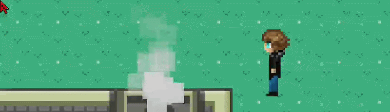

# new Hero();

> When accidentally brought to life by a game maker, **\<insert hero name>** realizes he is the only one who knows he's in a video game — a poorly written one. Luckily, he's a programmer. But will that be enough to conquer bugs, fight off bosses sent by the game's authors, and finally escape the game?

🔗 [Website](https://newhero-project.web.app/) &nbsp;•&nbsp; 📺 [Watch gameplay](https://www.youtube.com/watch?v=pizHP_Qk5Kg&t=1s)

---

## About the game

**new Hero();** is an educational 2D game. The plot follows a young programmer who gets trapped inside his own computer and must find a way back to the real world — defeating bosses and solving tasks along the way. Every fight combines a skill-based minigame with writing real C++ code to finally take the boss down.

## Motivation

The game was created for a [Polish national competition](https://mlodzi.pti.org.pl/) (2022/2023 edition), organized by PTI.

## Achievements

### 🥈 2nd Place — National Finals

The game earned **2nd place in the local eliminations**, followed by **2nd place in the national finals** (*Implementations* category).

[Read the full report →](https://mlodzi.pti.org.pl/sprawozdanie-z-ogolnopolskiego-konkursu-geek/)

## Our team

- [Sebastian Drabik](https://sdrabik.dev/)
- [Kacper Bronka](https://kacperbronka.github.io/)
- [Kacper Hanus](https://github.com/LegoKapiMan)
